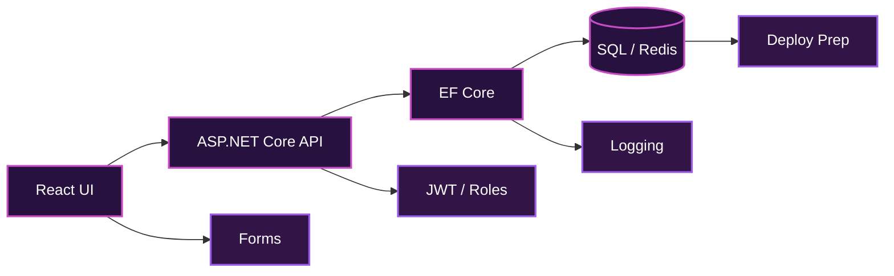

 

<pre>
┌──(matteo㉿violet-grid)-[~/fullstack/profile]
└─$ ./boot-profile.sh --theme cyberpunk --shell bash

 ███╗   ███╗ █████╗ ████████╗████████╗███████╗ ██████╗
 ████╗ ████║██╔══██╗╚══██╔══╝╚══██╔══╝██╔════╝██╔═══██╗
 ██╔████╔██║███████║   ██║      ██║   █████╗  ██║   ██║
 ██║╚██╔╝██║██╔══██║   ██║      ██║   ██╔══╝  ██║   ██║
 ██║ ╚═╝ ██║██║  ██║   ██║      ██║   ███████╗╚██████╔╝
 ╚═╝     ╚═╝╚═╝  ╚═╝   ╚═╝      ╚═╝   ╚══════╝ ╚═════╝

               P E N N A C C H I A   //   D E V   N O D E

[ OK ] bash shell connected       [ OK ] violet-cyclamen signal online
[ OK ] C#/.NET backend loaded     [ OK ] React interface initialized
[ OK ] SQL + Cloud pipeline       [ OK ] Remote / Hybrid EU channel

matteo@violet-grid:~$ whoami
Full Stack Developer  |  API Builder  |  Audio / DSP Explorer
</pre>

  

  

<pre>
╭──────────────────────────────────────────────────────────────────────────────╮
│                        MODE : BASH CYBERPUNK DEV                             │
│              STACK : C#/.NET  ·  REACT  ·  APIs  ·  SQL  ·  CLOUD            │
│             SIGNAL : REMOTE / HYBRID EU  ::  TERMINAL ONLINE                 │
╰──────────────────────────────────────────────────────────────────────────────╯
</pre>

<h2><code>matteo@violet-node:~/developer-profile</code></h2>

<pre>
{
  "name"         : "Matteo Pennacchia",
  "role"         : "Full Stack Developer",
  "core_stack"   : ["C#", ".NET 8", "ASP.NET Core", "React", "TypeScript"],
  "focus"        : ["REST APIs", "Database Design", "Secure Web Apps"],
  "location"     : "Ferentino, Frosinone, Italy",
  "availability" : "Remote / Hybrid across EU",
  "theme"        : "deep black terminal + violet cyclamen glow"
}
</pre>

 

  

<h2><code>01 // PROFESSIONAL PROFILE</code></h2>

<pre>
╭──────────────────────────────────────────────────────────────────────────────╮
│                                                                              │
│     I build secure, scalable and maintainable web applications with C#,     │
│        ASP.NET Core, React, TypeScript, REST APIs and SQL databases.         │
│                                                                              │
│       Database design  ·  Backend services  ·  Frontend interfaces          │
│              API integration  ·  Testing  ·  Deployment prep                 │
│                                                                              │
╰──────────────────────────────────────────────────────────────────────────────╯
</pre>

<h2><code>02 // SYSTEM PIPELINE</code></h2>

<h2><code>03 // STACK MODULES</code></h2>

<table align="center">
  <thead>
    <tr>
      <th align="center">MODULE</th>
      <th align="center">TOOLKIT</th>
    </tr>
  </thead>
  <tbody>
    <tr>
      <td align="center"><strong>BACKEND CORE</strong></td>
      <td align="center">C# · .NET 8 · ASP.NET Core · Web API · MVC · EF Core · LINQ</td>
    </tr>
    <tr>
      <td align="center"><strong>FRONTEND INTERFACE</strong></td>
      <td align="center">React · Next.js · TypeScript · HTML5 · CSS3 · Tailwind CSS</td>
    </tr>
    <tr>
      <td align="center"><strong>DATABASE + DEVOPS</strong></td>
      <td align="center">SQL Server · PostgreSQL · MySQL · MongoDB · Redis · Docker</td>
    </tr>
    <tr>
      <td align="center"><strong>CLOUD + DELIVERY</strong></td>
      <td align="center">Azure · AWS · Docker Compose · GitHub Actions · CI/CD</td>
    </tr>
  </tbody>
</table>

 

<h2><code>04 // ENGINEERING PATTERNS</code></h2>

<table align="center">
  <thead>
    <tr>
      <th align="center">SYSTEM DESIGN</th>
      <th align="center">RELIABILITY MODULES</th>
    </tr>
  </thead>
  <tbody>
    <tr>
      <td align="center">Clean Architecture · MVC · Repository Pattern</td>
      <td align="center">JWT Authentication · Role Authorization</td>
    </tr>
    <tr>
      <td align="center">Service Layer · SOLID · OOP · API-first</td>
      <td align="center">Swagger / OpenAPI · Postman Testing</td>
    </tr>
    <tr>
      <td align="center">Monoliths · Microservices basics</td>
      <td align="center">Error Handling · Logging · Automated Tests</td>
    </tr>
    <tr>
      <td align="center">Refactoring · Clean Code</td>
      <td align="center">Performance Tuning · Code Review</td>
    </tr>
  </tbody>
</table>

 

<h2><code>05 // FEATURED PROJECTS</code></h2>

<table align="center">
<tr>
<td width="50%" align="center" valign="top">

<h3><code>E-COMMERCE WEB APP</code></h3>

<strong>ASP.NET Core Web API · EF Core · SQL Server</strong> 
React · TypeScript · Tailwind CSS · Docker  

<code>catalog</code> · <code>JWT auth</code> · <code>cart</code> 
<code>checkout</code> · <code>orders</code> · <code>admin routes</code>

</td>
<td width="50%" align="center" valign="top">

<h3><code>BOOKING SYSTEM</code></h3>

<strong>ASP.NET Core · React · PostgreSQL</strong> 
Redis concepts · Docker  

<code>reservations</code> · <code>availability</code> 
<code>conflict prevention</code> · <code>dashboard</code>

</td>
</tr>
<tr>
<td width="50%" align="center" valign="top">

<h3><code>AUTOMATION DASHBOARD</code></h3>

<strong>C# · .NET · SQL · React</strong> 
GitHub Actions concepts  

<code>processing</code> · <code>reports</code> 
<code>structured logging</code> · <code>workflows</code>

</td>
<td width="50%" align="center" valign="top">

<h3><code>API INTEGRATION PLATFORM</code></h3>

<strong>ASP.NET Core Web API · React · SQL Server</strong> 
Swagger · Postman  

<code>third-party APIs</code> · <code>validation</code> 
<code>notifications</code> · <code>secure config</code>

</td>
</tr>
</table>

 

<h2><code>06 // GITHUB SIGNAL</code></h2>

  

  

<h2><code>07 // AUDIO + DSP SIDE CHANNEL</code></h2>

<pre>
╭──────────────────────────────────────────────────────────────────────────────╮
│                                                                              │
│        Audio programming  ·  DSP  ·  Game-audio experiments                 │
│                                                                              │
│     Synthesis  ·  Effects  ·  Filters  ·  Gain  ·  Envelopes                │
│             Oscillators  ·  Signal flow  ·  Real-time interaction            │
│                                                                              │
╰──────────────────────────────────────────────────────────────────────────────╯
</pre>

<h2><code>08 // CURRENTLY BUILDING</code></h2>

<pre>
╭──────────────────────────────────────────────────────────────────────────────╮
│                           CURRENT QUEST LOG                                  │
├──────────────────────────────────────────────────────────────────────────────┤
│                     ▣  ASP.NET Core backend systems                         │
│                     ▣  REST APIs with Swagger docs                          │
│                     ▣  Relational schemas and queries                       │
│                     ▣  React dashboards and workflows                       │
│                     ▣  Cloud deployment and CI/CD                           │
│                     ▣  Audio / DSP creative experiments                     │
╰──────────────────────────────────────────────────────────────────────────────╯
</pre>

<h2><code>FINAL FORM</code></h2>

<pre>
╔══════════════════════════════════════════════════════════════════════════════╗
║                                                                              ║
║              FULL STACK DEVELOPER  │  API BUILDER  │  DEBUG ENGINEER         ║
║                                                                              ║
║              C#/.NET backend       React frontend       SQL architecture     ║
║              Docker delivery       Cloud learning       Git discipline       ║
║              Violet-cyclamen glow  Audio experiments    Ship-ready mindset   ║
║                                                                              ║
╚══════════════════════════════════════════════════════════════════════════════╝
</pre>

