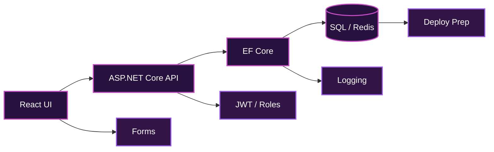

<div align="center">


<br/>

[](https://dotnet.microsoft.com/)
[](https://dotnet.microsoft.com/)
[](https://react.dev/)
[](https://www.microsoft.com/sql-server)
[](https://www.docker.com/)

</div>

```text
╭──────────────────────────────────────────────────────────────────────────────╮
│                        MODE : VIOLET CYCLAMEN DEV                            │
│              STACK : C#/.NET  ·  React  ·  APIs  ·  SQL  ·  Cloud            │
│             SIGNAL : Remote / Hybrid EU  ::  Precise Terminal UI              │
╰──────────────────────────────────────────────────────────────────────────────╯
```

## `matteo@violet-node:~/developer-profile`

```json
{
  "name": "Matteo Pennacchia",
  "role": "Full Stack Developer",
  "core_stack": ["C#", ".NET 8", "ASP.NET Core", "React", "TypeScript"],
  "focus": ["REST APIs", "Database Design", "Secure Web Apps", "Cloud-ready Deployments"],
  "location": "Ferentino, Frosinone, Italy",
  "availability": "Remote / Hybrid across EU",
  "theme": "deep black terminal + violet cyclamen glow"
}
```

<div align="center">

[](mailto:matteopennacchia43@gmail.com)
[](https://github.com/matteopennacchia43-netizen)
[](https://linkedin.com/in/matteopennacchia)
[](https://cybermassliturgyshopghostcathedral.com)

</div>

## `01 // Professional profile`

```text
╭──────────────────────────────────────────────────────────────────────────────╮
│ I build secure, scalable, and maintainable web applications using C#,        │
│ ASP.NET Core, React, TypeScript, REST APIs, and relational databases.         │
│                                                                              │
│ I work across database design, backend services, frontend implementation,    │
│ API integration, testing, deployment preparation, and production support.    │
╰──────────────────────────────────────────────────────────────────────────────╯
```

## `02 // System pipeline`



## `03 // Stack modules`

| Module | Toolkit |
|:--|:--|
| **Backend Core** | C# · .NET 8 · ASP.NET Core · Web API · MVC · EF Core · LINQ |
| **Frontend Interface** | React · Next.js · TypeScript · JavaScript ES6+ · HTML5 · CSS3 · Tailwind CSS |
| **Database & DevOps** | SQL Server · PostgreSQL · MySQL · MongoDB · Redis · Docker · GitHub Actions |
| **Cloud & Delivery** | Azure · AWS · Docker Compose · API deployment preparation |

## `04 // Engineering patterns`

| System Design | Reliability Modules |
|:--|:--|
| Clean Architecture · MVC · Repository Pattern | JWT Authentication · Role-based Authorization |
| Service Layer · SOLID · OOP · API-first | Swagger / OpenAPI · Postman API Testing |
| Monoliths · Microservices basics | Error Handling · Logging · Unit / Integration Testing |
| Refactoring · Clean code | Performance Tuning · Code Review |

## `05 // Featured projects`

<table>
<tr>
<td width="50%" valign="top">

### `E-COMMERCE WEB APP`
**Stack:** ASP.NET Core Web API · EF Core · SQL Server  
**UI:** React · TypeScript · Tailwind CSS  
**Ops:** Docker  

`catalog` · `JWT auth` · `cart` · `checkout` · `orders` · `admin routes` · `pagination`

</td>
<td width="50%" valign="top">

### `BOOKING / RESERVATION SYSTEM`
**Stack:** ASP.NET Core · React · PostgreSQL  
**Cache:** Redis concepts  
**Ops:** Docker  

`reservations` · `availability logic` · `conflict prevention` · `admin dashboard`

</td>
</tr>
<tr>
<td width="50%" valign="top">

### `BUSINESS AUTOMATION DASHBOARD`
**Stack:** C# · .NET · SQL · React  
**CI/CD:** GitHub Actions concepts  

`scheduled processing` · `reporting` · `structured logging` · `workflows`

</td>
<td width="50%" valign="top">

### `API INTEGRATION PLATFORM`
**Stack:** ASP.NET Core Web API · React · SQL Server  
**Tools:** Swagger · Postman  

`third-party APIs` · `notifications` · `validation` · `secure configuration`

</td>
</tr>
</table>

## `06 // GitHub signal`

<div align="center">


</div>

## `07 // Audio / DSP side channel`

```text
╭──────────────────────────────────────────────────────────────────────────────╮
│ I explore audio programming, DSP, and game-audio experiments: synthesis,     │
│ effects, sample playback, real-time interaction, filters, gain, envelopes,   │
│ oscillators, signal flow, and practical performance constraints.              │
╰──────────────────────────────────────────────────────────────────────────────╯
```

## `08 // Currently building`

```text
┌─[current-quest-log]──────────────────────────────────────────────────────────┐
│ ▣ Backend systems with ASP.NET Core                                          │
│ ▣ Clean REST APIs documented with Swagger                                   │
│ ▣ Relational schemas and optimized queries                                  │
│ ▣ React dashboards and frontend workflows                                   │
│ ▣ Deeper cloud deployment and CI/CD practice                                │
│ ▣ Audio / DSP experiments for creative software                             │
└──────────────────────────────────────────────────────────────────────────────┘
```

<div align="center">

```text
╔══════════════════════════════════ FINAL FORM ════════════════════════════════╗
║                                                                              ║
║        FULL STACK DEVELOPER  │  API BUILDER  │  DEBUG ENGINEER               ║
║                                                                              ║
║        C#/.NET backend       React frontend       SQL architecture            ║
║        Docker delivery       Cloud learning       Git discipline             ║
║        Violet-cyclamen glow  Audio experiments    Ship-ready mindset         ║
║                                                                              ║
╚══════════════════════════════════════════════════════════════════════════════╝
```


</div>
